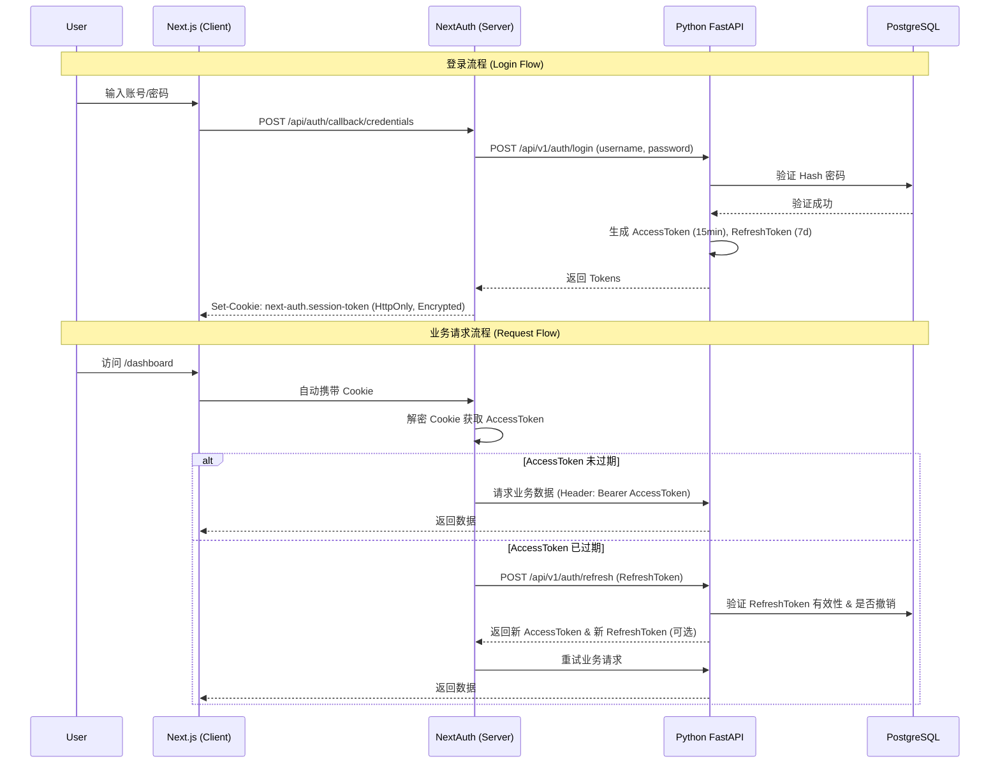

# AlphaSignal 身份认证与授权系统架构设计文档 (v2.0)

**版本**: 2.0 (Enterprise Ready)  
**状态**: Draft  
**日期**: 2026-02-07  
**作者**: Gemini CLI Agent

---

## 1. 概述 (Executive Summary)

本文档详细描述了 AlphaSignal 项目的身份认证与授权系统架构。本系统采用 **前后端分离的 OAuth2 架构**，旨在提供高安全性、可扩展性及跨平台（Web, iOS）一致性。

### 核心设计目标
1.  **安全性 (Security First)**: 遵循 OWASP Top 10 安全建议，杜绝 SQL 注入、XSS 和 CSRF 攻击。核心凭据（RefreshToken）在 Web 端通过 **HttpOnly Cookie** 传输。
2.  **无状态性 (Statelessness)**: Python 后端通过 JWT (JSON Web Tokens) 验证请求，无需服务器端 Session 存储，易于横向扩展。
3.  **多端统一 (Unified Identity)**: 一套后端 API 同时服务于 Next.js Web 和未来的 iOS App。
4.  **无感刷新 (Silent Refresh)**: 实现 Token 自动轮转 (Rotation)，用户长期免登录且保持会话安全。

---

## 2. 系统架构 (System Architecture)

### 2.1 交互流程图



### 2.2 关键组件定义

| 组件 | 技术栈 | 职责 |
| :--- | :--- | :--- |
| **Identity Provider (IdP)** | Python FastAPI | 唯一的认证真理源。负责用户管理、密码验证、Token 签发与撤销。 |
| **BFF / Gateway** | Next.js (NextAuth v5) | Web 端的会话代理。负责 Cookie 管理、Token 自动刷新、服务端渲染(SSR)鉴权。 |
| **Client (Mobile)** | iOS (SwiftUI) | 移动端客户端。直接与 IdP 交互，使用 Keychain 存储 Tokens。 |
| **Storage** | PostgreSQL | 持久化存储用户数据、RefreshToken 记录、审计日志。 |

---

## 3. 数据库详细设计 (Database Schema)

基于 PostgreSQL，需新增以下表结构。

### 3.1 ER 图描述

*   **Users**: 核心用户表。
*   **RefreshTokens**: 刷新令牌表，用于管理会话生命周期。
*   **AuditLogs**: 安全审计日志。

### 3.2 DDL 定义

```sql
-- 1. 启用 UUID 扩展
CREATE EXTENSION IF NOT EXISTS "pgcrypto";

-- 2. 用户表
CREATE TABLE users (
    id UUID PRIMARY KEY DEFAULT gen_random_uuid(),
    email VARCHAR(255) UNIQUE NOT NULL,
    hashed_password VARCHAR(255) NOT NULL,
    full_name VARCHAR(100),
    role VARCHAR(20) DEFAULT 'user' CHECK (role IN ('user', 'subscriber', 'admin')),
    is_active BOOLEAN DEFAULT TRUE,
    is_verified BOOLEAN DEFAULT FALSE,
    created_at TIMESTAMPTZ DEFAULT CURRENT_TIMESTAMP,
    updated_at TIMESTAMPTZ DEFAULT CURRENT_TIMESTAMP
);

-- 3. 刷新令牌表 (支持多设备登录与强制下线)
CREATE TABLE refresh_tokens (
    id SERIAL PRIMARY KEY,
    user_id UUID REFERENCES users(id) ON DELETE CASCADE,
    token_hash VARCHAR(255) NOT NULL, -- 安全起见，数据库只存 RefreshToken 的 Hash
    device_name VARCHAR(255),         -- 例如 "Safari on macOS"
    ip_address INET,
    expires_at TIMESTAMPTZ NOT NULL,
    created_at TIMESTAMPTZ DEFAULT CURRENT_TIMESTAMP,
    revoked_at TIMESTAMPTZ,           -- 不为空则视为失效
    replaced_by_token_hash VARCHAR(255) -- 用于 Token 轮转链追踪
);

CREATE INDEX idx_refresh_tokens_token_hash ON refresh_tokens(token_hash);
CREATE INDEX idx_refresh_tokens_user_id ON refresh_tokens(user_id);

-- 4. 审计日志表
CREATE TABLE auth_audit_logs (
    id SERIAL PRIMARY KEY,
    user_id UUID,
    action VARCHAR(50) NOT NULL, -- LOGIN, REFRESH, LOGOUT, FAILED_LOGIN
    ip_address INET,
    user_agent TEXT,
    details JSONB,
    created_at TIMESTAMPTZ DEFAULT CURRENT_TIMESTAMP
);
```

---

## 4. 后端开发细节 (Python FastAPI)

### 4.1 目录结构 (`src/alphasignal/auth`)

```text
src/alphasignal/auth/
├── __init__.py
├── config.py           # JWT 密钥、过期时间配置
├── schemas.py          # Pydantic 模型 (Request/Response)
├── models.py           # SQLAlchemy 数据库模型
├── security.py         # 核心工具: verify_password, create_access_token
├── service.py          # 业务逻辑: authenticate_user, refresh_token
├── dependencies.py     # FastAPI Depends: get_current_user
└── router.py           # API 路由定义
```

### 4.2 核心算法与配置

*   **JWT 签名算法**: `HS256` (HMAC SHA-256).
*   **Access Token 有效期**: 15 分钟.
*   **Refresh Token 有效期**: 7 天 (可配置).
*   **Token 载荷 (Payload)**:
    ```json
    {
      "sub": "user_uuid",
      "email": "user@example.com",
      "role": "admin",
      "exp": 1700000000,
      "type": "access"
    }
    ```

### 4.3 关键 API 定义

#### A. 登录接口
*   **Endpoint**: `POST /api/v1/auth/login`
*   **Content-Type**: `application/x-www-form-urlencoded` (OAuth2 标准)
*   **Parameters**: `username` (email), `password`
*   **Response**:
    ```json
    {
        "access_token": "eyJhbG...",
        "refresh_token": "def502...",
        "token_type": "bearer",
        "expires_in": 900,
        "user": { "id": "...", "email": "...", "role": "..." }
    }
    ```

#### B. 刷新接口
*   **Endpoint**: `POST /api/v1/auth/refresh`
*   **Body**: `{"refresh_token": "..."}`
*   **Logic**:
    1.  校验 `refresh_token` 格式与签名。
    2.  查询数据库 `refresh_tokens` 表，确认未撤销且未过期。
    3.  **Token 轮转 (可选高安模式)**: 吊销旧 Refresh Token，签发新的一对 Access + Refresh Token。
    4.  返回新 Tokens。

#### C. 获取当前用户 (鉴权示例)
*   **Endpoint**: `GET /api/v1/users/me`
*   **Header**: `Authorization: Bearer <access_token>`
*   **Dependency**: `get_current_user` 函数自动解析 Header，验证 JWT，提取 `sub` 字段查询数据库。

---

## 5. 前端开发细节 (Next.js + NextAuth)

### 5.1 NextAuth 配置 (`web/auth.ts`)

使用 `CredentialsProvider` 自定义逻辑。

```typescript
// 伪代码逻辑
Providers: [
  CredentialsProvider({
    async authorize(credentials) {
      // 1. 转发请求给 Python 后端
      const res = await fetch(`${API_URL}/auth/login`, {
        method: 'POST',
        body: new URLSearchParams({ 
          username: credentials.email, 
          password: credentials.password 
        })
      });
      
      const user = await res.json();
      
      if (res.ok && user) {
        // 返回对象将存入 JWT
        return user; 
      }
      return null;
    }
  })
]
```

### 5.2 Token 自动刷新回调 (`callbacks.jwt`)

这是实现无感刷新的关键。

```typescript
callbacks: {
  async jwt({ token, user }) {
    // 1. 初始登录：将后端返回的 tokens 存入 NextAuth token
    if (user) {
      return {
        ...token,
        accessToken: user.access_token,
        refreshToken: user.refresh_token,
        accessTokenExpires: Date.now() + user.expires_in * 1000,
        user: user.user
      }
    }

    // 2. 再次访问：检查是否过期
    if (Date.now() < token.accessTokenExpires) {
      return token;
    }

    // 3. 已过期：执行刷新逻辑
    return await refreshAccessToken(token);
  },
  
  async session({ session, token }) {
    // 将 AccessToken 暴露给前端组件 (Client Components)
    session.user = token.user;
    session.accessToken = token.accessToken;
    return session;
  }
}
```

---

## 6. iOS 开发指引 (SwiftUI)

*   **网络库**: 使用 Alamofire 或直接封装 URLSession。
*   **Keychain**: 使用 `KeychainAccess` 库存储 `accessToken` 和 `refreshToken`。
*   **Authenticator**: 实现一个 `ObservableObject` 类管理登录状态。
    *   `login(email, password)`: 调用 API，成功后写入 Keychain，设置 `isLoggedIn = true`。
    *   `interceptor`: 拦截所有 401 响应，尝试调用 refresh API。若 refresh 成功，重试原请求；若失败，清空 Keychain，设置 `isLoggedIn = false` (踢回登录页)。

---

## 7. 安全与合规清单 (Security Checklist)

1.  [ ] **密码哈希**: 强制使用 `bcrypt` (work factor >= 12)。
2.  [ ] **传输加密**: 所有 Auth 相关接口必须通过 HTTPS 访问 (生产环境)。
3.  [ ] **HttpOnly**: Web 端 Refresh Token 不暴露给 JS。
4.  [ ] **错误模糊化**: 登录失败时统一提示“用户名或密码错误”，防止账号枚举。
5.  [ ] **速率限制 (Rate Limiting)**: 登录接口限制每 IP 每分钟 5 次尝试。

---

## 8. 实施计划 (Implementation Plan)

### Phase 1: 基础设施构建
1.  Python 依赖安装 (`python-jose`, `passlib`).
2.  PostgreSQL `users` 表和 `refresh_tokens` 表迁移脚本编写与执行.
3.  后端 `auth` 模块基础代码 (Hash, JWT 工具) 编写.

### Phase 2: 后端 API 开发
1.  实现 `/register` 接口.
2.  实现 `/login` (OAuth2 Password flow) 接口.
3.  实现 `/refresh` 接口.
4.  编写 Pytest 单元测试覆盖核心流程.

### Phase 3: Web 端集成
1.  Next.js 安装 `next-auth@beta` (v5).
2.  配置 `auth.ts` 及 Middleware.
3.  开发登录页面 (`app/login/page.tsx`).
4.  集成 API 请求自动携带 Token.

### Phase 4: 业务数据打通
1.  修改 `Watchlist` 相关 API，从 Token 解析 User ID.
2.  测试多用户隔离性.
