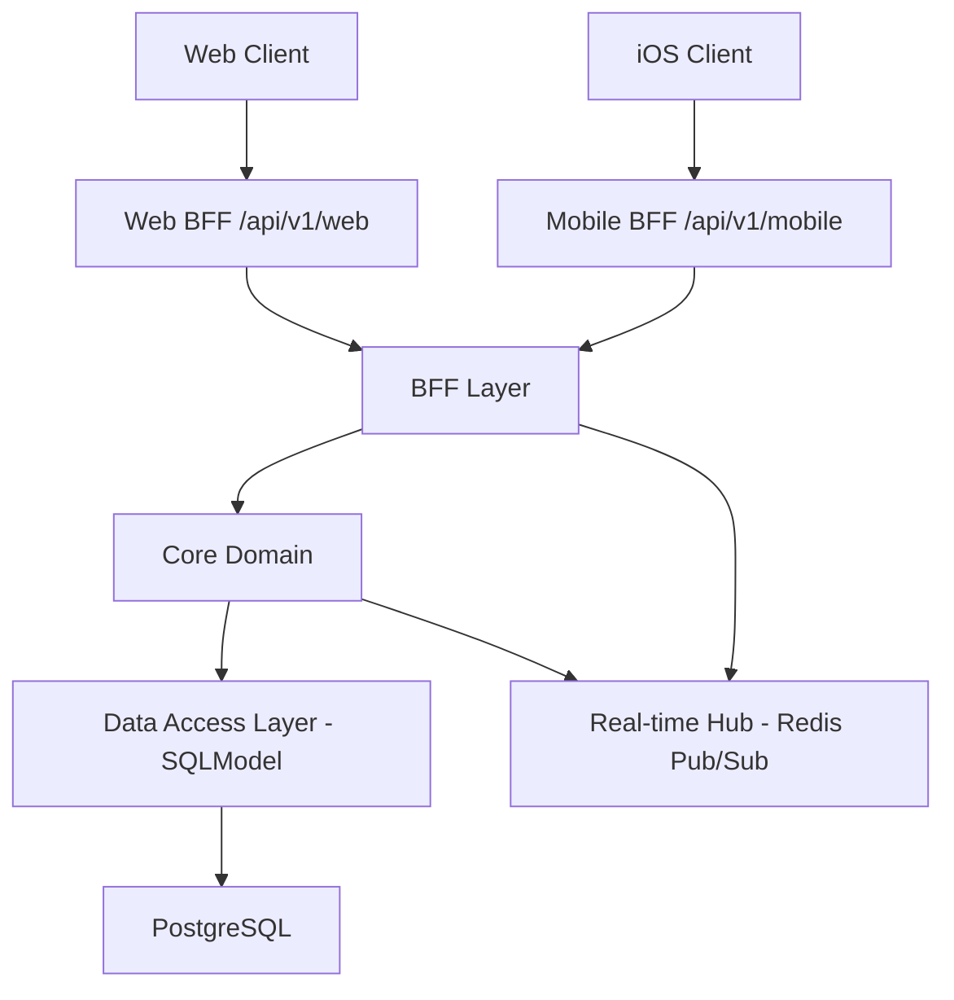

# AlphaSignal Backend V1 接口架构改造文档

## 1. 改造背景
为了解决 Web 与 iOS 端数据契约不一致、移动端流量冗余以及实时推送延迟较高的问题，AlphaSignal 正式启动从“脚本驱动模式”向“分层生产级架构”的迁移。

## 2. 核心架构拓扑 (BFF Architecture)

## 3. 关键组件说明

### 3.1 数据契约 (Strong Typing)
*   **SQLModel**: 结合了 Pydantic 和 SQLAlchemy，确保了数据库模型与 API 响应模型的高度统一。
*   **Decimal 处理**: 实现了递归的 `decimal_to_float` 转换器，解决了 PostgreSQL `NUMERIC` 类型在前端解析时的兼容性陷阱。

### 3.2 广播中枢 (Real-time Delivery)
*   **技术栈**: Redis 7.0 + `redis.asyncio`。
*   **多路复用**: 新增 `/api/v1/intelligence/stream` 接口，不再轮询数据库，延迟从 2s 降低至 < 100ms。
*   **解耦**: `FundEngine` 在计算完成后仅需向 Redis `PUBLISH`，无需感知连接详情。

### 3.3 BFF 差异化适配
*   **Web 端**: 保持 `JSONB` 透传，支持多语言本地化和重型 Plotly 分析。
*   **Mobile 端**: 
    *   **字段裁剪**: 移除 `content` 等长文本，仅保留 `summary`。
    *   **扁平化**: 将复杂的嵌套对象展平为 Native DTO 格式。

## 4. 行情计算逻辑下沉
原本在 Web 端 Node.js 实现的金融算法现已全部收口至 Python 核心层：
*   **`MarketService`**: 负责 AU9999 与 COMEX 的价差换算、汇率对齐。
*   **`ValuationActor`**: 负责动态 2σ 计算。

## 5. 版本兼容性策略 (Versioning)
*   **V1 路径**: `/api/v1/...`
*   **Legacy 路径**: `/api/...` (保留中，直至 Web 全部平滑过渡)。
*   **契约保护**: 所有 V1 接口必须经过 Pydantic Schema 校验。

## 6. 后续演进
*   **Alembic**: 引入数据库自动迁移。
*   **Request Validation**: 全局集成 FastAPI 的 `RequestValidation` 错误捕获。
*   **OpenAPI Specs**: 生成并导出标准的 Swagger JSON 供 iOS 自动生成网络模型。
